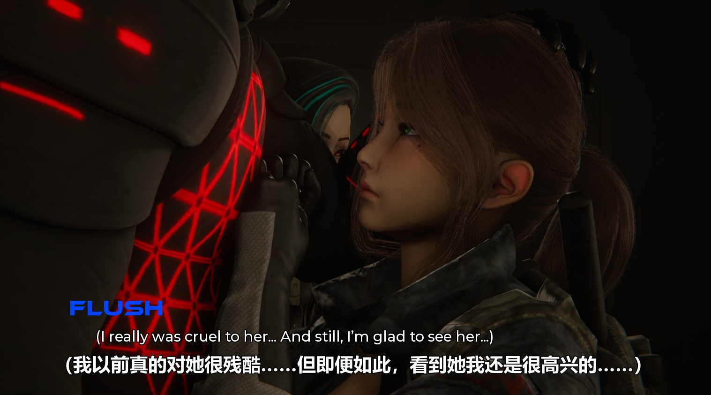

#  RenpyLens

RenpyLens 是一款专为 **Ren'Py 引擎游戏** 开发的轻量级、实时游戏翻译弹窗工具。
本软件既**小白友好**（支持一键拖拽翻译），又适合有一定基础的用户上手部署或二次开发。

通过原生的注入方式，在游戏运行期间实时抓取文本，并使用强大的 **AI大语言模型引擎** 将其翻译为您需要的语言，浮窗显示在游戏之上。
本软件处于频繁更新迭代期，欢迎加入交流。

## 💬 交流与支持

- **官方 QQ 交流群**：1058127921

- 入群获取最新动态及内测功能

## ✨ 核心特性

- **拖拽式一键操作**: 直接将游戏的 `.exe` 文件拖入主界面即可。
- **动态 Hook 注入**: 原生文本提取。通过 Hook 脚本直接桥接 Ren'Py 游戏引擎，实现无损文本提取。
- **多引擎支持 (LLMs)**: 本地和云端大语言模型无缝切换，保证上下文连贯性和角色语气：
  - **内置引擎**: 我们为用户提供的首选专属服务，开箱即用，极简操作免去配置烦恼。
  - **云端大厂 API**: 内置兼容 Gemini, 智谱 (GLM), OpenAI, Anthropic (Claude), DeepSeek, Moonshot, X.AI, 阿里云 (Qwen), 火山引擎 等。
  - **Ollama**: 本地离线模型支持。
  - **自定义节点**: 支持兼容 OpenAI 格式的第三方/自建 API 端点接入。
- **覆盖层浮窗**: 翻译结果显示在一个无边框、可拖动、可调节的浮窗上，不干扰游戏的原始画面。
- **工作台与手动校对**: 提供最近翻译条目工作台，支持直接编辑译文、自动保存修订，并保留手动翻译与机器翻译的区别。
- **一键全游戏翻译**: 可扫描整部游戏脚本并分批翻译，支持进度显示、频率限制和随时取消。
- **缓存与防抖机制**: 内置 SQLite + 内存双层独立缓存（按游戏隔离）。同时支持防抖，适配玩家快进文本。
- **自动更新**: 启动后可自动检查 GitHub Release，新版本可直接下载并重启更新。

## 📸 运行效果示例



## 🆕 版本更新

### v1.2.0 `最新`
- **工作台与手动校对**: 新增最近翻译条目的工作台窗口，支持查看、编辑、自动保存与未保存确认，方便把机器译文快速修正为人工译文。
- **一键全游戏翻译**: 新增整游戏扫描与批量翻译流程，支持按批次处理、取消任务、显示进度，并复用缓存避免重复翻译。
- **浮窗编辑升级**: 浮窗右键菜单可直接编辑当前对白与选项，新增“显示工作台”入口，翻译结果的修订更顺手。
- **缓存与记录增强**: 翻译缓存新增说话人、条目类型、手动/机器翻译标记与最近访问统计，便于后续复用和整理。
- **自动更新**: 启动后会自动检查 GitHub Release，并支持下载更新包后完成自替换重启。

### v1.1.4
- **翻译性能与并发稳定性提升**: 修复高频翻页时可能长时间等待的竞态问题；完善 inflight/cached 协同与线程锁，减少重复翻译请求。
- **菜单显示与采集修复**: 修复菜单说明文字被错误编号为选项的问题；菜单 Hook 现仅采集当前条件下可见的选项，避免浮窗出现“游戏里未显示”的分支。
- **浮窗交互升级**: 新增主窗口一键显示/隐藏浮窗；浮窗支持可见状态回传，重新显示时可自动回到屏幕中下区域。
- **状态栏与引擎切换体验优化**: 修复状态栏可能卡在“预加载”提示的问题；游戏运行期间禁用引擎切换，结束后自动恢复，降低切换冲突。
- **OpenAI 兼容接口增强**: 优化 `/v1` 与 `/chat/completions` 地址归一化，提升 OpenAI 兼容网关（含多种中转地址）配置成功率。

### v1.1.3
- **内置通道优化**: 接入了到期时间查询逻辑，支持实时刷新 API 状态；UI 布局微调，更加整洁。
- **关于页面升级**: 在“关于”页面增加了官方交流群二维码，方便大伙入群交流，获取最新资讯。

### v1.1.2
- **内置通道模型升级**: 后端模型全面升级，模型更大更强，翻译更地道、符合语境。
- **菜单选项翻译**: Hook 逻辑深度重版，现已支持游戏内菜单选项（Choice）抓取与同步翻译。
- **显示优化**: UI 重新设计，翻译浮窗现在能同时显示对话文本和翻译后的菜单选项。

### v1.1.1
- **翻译与提示词调优**: 优化 Prompt 为本地化专家视角，拒绝直译，翻译更自然；自动清理 `<think>` 等思维链标签。
- **外观定制**: 右键菜单支持修改字体系列（楷体等）、粗体开关及多种字体颜色，且支持持久化。
- **模型与稳定性修复**: 显式禁用部分模型的 thinking 模式，增强响应速度，修复特定环境下文本渲染模糊的问题。

### v1.1.0
- **翻译准度和遵循指令升级**: 大幅增强内置通道模型翻译速度和精准度，更好地遵循指令（如：不翻译人名）。
- **重构 Hook 逻辑**: 全面升级了注入 Hook 脚本，修复了之前部分基础版游戏引擎可能无法触发、显示弹窗的问题，兼容性更广。
- **浮窗视觉表现强化**: 支持显示原文角色名、斜体排版渲染（心理活动更直观）以及强力置顶功能（解决全屏游戏遮挡痛点）。

## 🎮 软件使用

1. **获取软件**:
   - 直接点击右侧的 **Releases** 页面下载最新版的 `RenpyLens.exe`。
   - 或者也可以按照下方的 **[🛠️ 代码开发](#-代码开发)** 步骤，自行克隆代码并使用 Python 运行或打包。
2. **配置 API / 模型**: 
   - **无自有 API / 极简操作用户**: 直接双击 `.exe` 打开软件，在翻译引擎中选择 **"内置通道"**，点击 **"🔑 获取试用 API"**，成功后即可直接导入游戏体验。
   - **自带 API / 高阶用户**: 点击 **“⚙️ 设置”** 按钮。在 **“API 设置”** 选项卡中，填入 LLM 服务商密钥及相关配置（例如 Gemini 或 Ollama 的本地地址端口）。
      > **模型建议**: 尽量选择 **不带** CoT (Chain of Thought) 思考能力的模型。由于实时翻译不需要 thinking，且本项目目前尚未对所有模型适配自动关闭 thinking 的功能，使用此类模型可能会因生成思考过程而导致输出冗余、响应变慢。
3. **选择游戏**:
   - 将需要翻译的 Ren'Py 游戏的主程序 `.exe` 直接拖拽到软件界面的指定区域。
4. **注入并启动**:
   - 拖入后，点击 **"▶ 开始游戏"**，工具会自动将所需的脚本放入游戏的 `game/` 文件夹下。
   - 游戏启动后，翻译浮窗会自动弹出。当游戏中出现新对话时，浮窗会实时显示翻译结果。
5. **浮窗控制**:
   - **拖动位置**: 鼠标左键按住浮窗上的文字拖动即可自由调整翻译界面在游戏上的位置。
   - **更多设置**: 鼠标 **右击文字** 即可唤出快捷菜单，进行更多控制。
6. **清理与卸载**:
   - 游戏结束后，你可以点击 **"📤 卸载 Hook"** 将翻译脚本从游戏目录中安全移除，恢复游戏原貌。
   - 若遇到翻译卡死或缓存的文案需要修改，可点击 **"🧹 清除当前游戏缓存"** 重置。

## 🛠️ 代码开发

### 环境要求
- Windows 操作系统 (推荐)
- Python 3.10+

### 克隆与安装

```bash
git clone https://github.com/your-username/RenpyLens.git
cd RenpyLens

# 使用虚拟环境 (推荐)
python -m venv venv
venv\Scripts\activate

# 安装依赖
pip install -r requirements.txt
```

### 运行应用

```bash
python main.py
```

## 📦 打包可执行文件

使用附带的打包脚本可以一键打包成单文件 `.exe`。

```bash
# 需确保环境中已安装 pyinstaller
python build.py

# 如果需要使用特定的 Python 环境进行打包，可使用 --python 参数：
python build.py --python "C:\path\to\your\venv\python.exe"
```
打包成功后，独立的可执行文件为 `RenpyLens.exe`。
> **注意**: 该脚本会自动利用 `upx.exe`（如果存在同级目录）进行体积压缩。

## 🧩 架构简介

- **`main.py` & `settings_dialog.py`**: 基于 PyQt5 的核心 UI 与事件流。
- **`workbench.py`**: 最近条目工作台、手动编辑与批量翻译状态面板。
- **`updater.py`**: GitHub Release 检查、更新包下载与 Windows 自更新脚本。
- **`injector.py`**: 负责识别 Ren'Py 游戏并安全注入改写的 `_translator_hook.rpy`。
- **`translator.py`**: 多并发、具有池化思想的 LLM 翻译引擎网络请求封装。
- **`hook_server.py`**: 本地 TCP 服务端，负责与注入到游戏内部的 Hook 脚本进行极低延迟的双向通讯。
- **`cache.py`**: 本地翻译记忆库（SQLite），提高相同对话的显示速度并降低 API 开销。
- **`_translator_hook.rpy`**: (Ren'Py 脚本层) 挂载于游戏的内部生命周期，实现在每一句台词抛出屏幕前进行劫持、传递与等待。


## 📄 许可证 (License)

本项目采用 [GPLv3 License](LICENSE) 许可协议开源。


